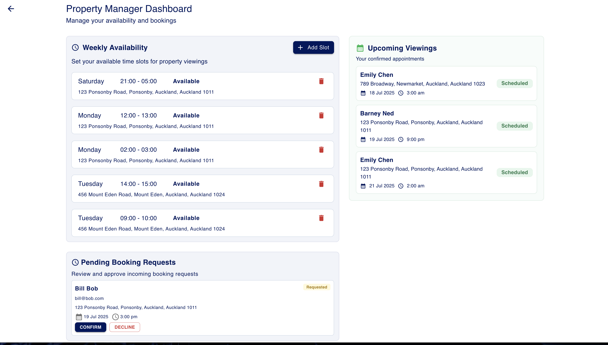
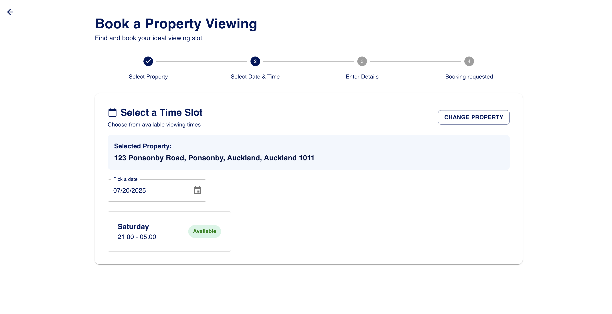

# PropertyViewingSystem

A property viewing booking system that allows property managers to manage properties and availability slots while enabling potential tenants to book property viewings seamlessly.

## Description and functionality

This is a full-stack web application built with Ruby on Rails API backend, a React frontend using Material UI components and SQLite as its database. It provides a platform for:

### For Property Managers:
- **Availability Scheduling**: Create and manage time slots when properties are available for viewing
- **Viewing Management**: Track and manage all scheduled property viewings
- **Tenant Communication**: View potential tenant information and manage viewing requests



### For Potential Tenants:
- **Property Discovery**: Browse available properties
- **Create Booking**: Select properties and book available viewing time slots



## Getting started

### Backend Setup
1. Navigate to the backend directory:
   ```bash
   cd backend
   ```

2. Install Ruby dependencies:
   ```bash
   bundle install
   ```

3. Setup the database:
   ```bash
   rails db:create
   rails db:migrate
   rails db:seed
   ```

4. Run the Rails server:
   ```bash
   rails server
   ```
   The API will be available at `http://localhost:3000`

### Frontend Setup
1. Navigate to the frontend directory:
   ```bash
   cd frontend
   ```

2. Install Node.js dependencies:
   ```bash
   npm install
   ```

3. Start the React development server:
   ```bash
   npm start
   ```
   The application will be available at `http://localhost:3001`

## DB Tables and relationships

### Core Models

#### Property
- **Fields**: address, property_type, price, bedrooms, bathrooms, square_footage, description, status
- **Types**: Apartment, House, Condo, Townhouse
- **Status**: Available, Under Contract, Sold, Rented
- **Relationships**:
  - belongs_to :property_manager
  - has_many :viewings
  - has_many :availability_slots
  - has_many :potential_tenants (through viewings)

#### PropertyManager
- **Fields**: name, email, phone
- **Validations**: Email uniqueness, format validation, automatic email downcasing
- **Relationships**:
  - has_many :properties (dependent: destroy)
  - has_many :availability_slots (dependent: destroy)
  - has_many :viewings (through properties)

#### PotentialTenant
- **Fields**: name, email, phone
- **Validations**: Email uniqueness, format validation, automatic email downcasing
- **Relationships**:
  - has_many :viewings (dependent: destroy)
  - has_many :properties (through viewings)

#### Viewing
- **Fields**: scheduled_at, status
- **Status Values**: Scheduled, Completed, Cancelled, No Show, Requested
- **Business Rules**: Scheduled viewings must be in the future
- **Relationships**:
  - belongs_to :property
  - belongs_to :potential_tenant

#### AvailabilitySlot
- **Fields**: start_time, end_time, day_of_week, is_available
- **Days**: Monday through Sunday
- **Validations**: No overlapping time slots, end_time must be after start_time
- **Relationships**:
  - belongs_to :property
  - belongs_to :property_manager

##### Notes
Property Manager and Potential tenant could have been a users table with a role however i wanted them to have unquie relationships and in future ild imagine they would have other fields eg (tenants could have attachments and property manager could have company details)

## Future improvements

### Feature Expansions & Enhancements
- **Authentication**: Add authentication and authorization
- **Users Table**: Create a users table with a relationship to the potential tenants and property managers. This way potential tenants could look at saved bookings etc but login shouldnt be required for potential tenants
- **Log in page**: Current landing page is for ease of use. Note: Property manager section is hardcoded to use property manager 1 for demo purposes.
- **Email Notifications**: Automated email confirmations for bookings
- **Calendar Integration**: Sync with Google Calendar or Outlook
- **Search & Filters**: Advanced property search with location, price, and amenity filters
- **Manage Properties**: Add a page where the property manager can create, update and remove existing properties
- **Edit Availability Slots**: Currently you just delete and add new. We should be able to edit them.
- **Account Page**: Where users can update their details
- **Image Support**: Implement Active Storage for property images
- **Submit applications**: The tenant should be able to apply for the property and send documents to property manager

### Scalability & Performance
- **Database Optimization**: Use PostgreSQL instead of SQLite
- **Caching**: Redis implementation for improved performance
- **API Rate Limiting**: Prevent abuse and ensure fair usage
- **Monitoring**: Application performance monitoring and logging
